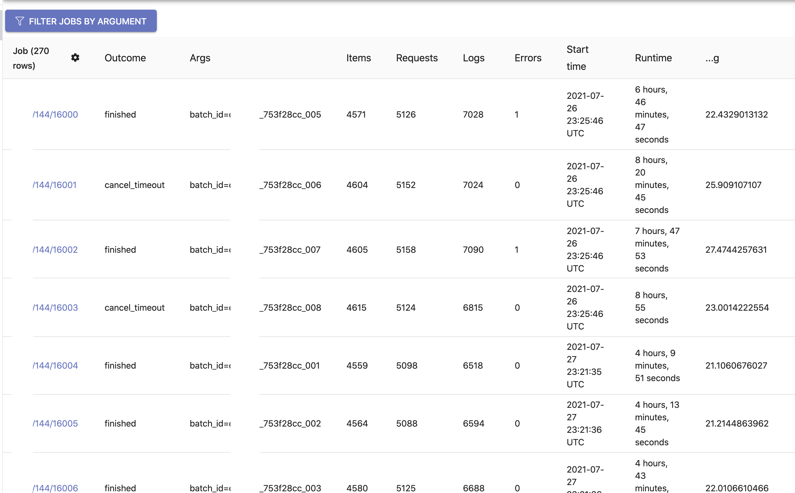
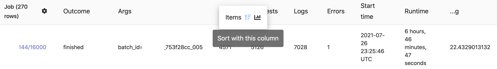
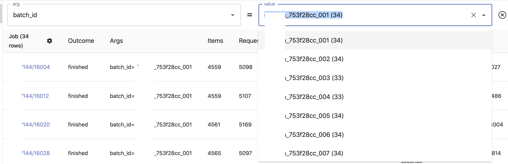
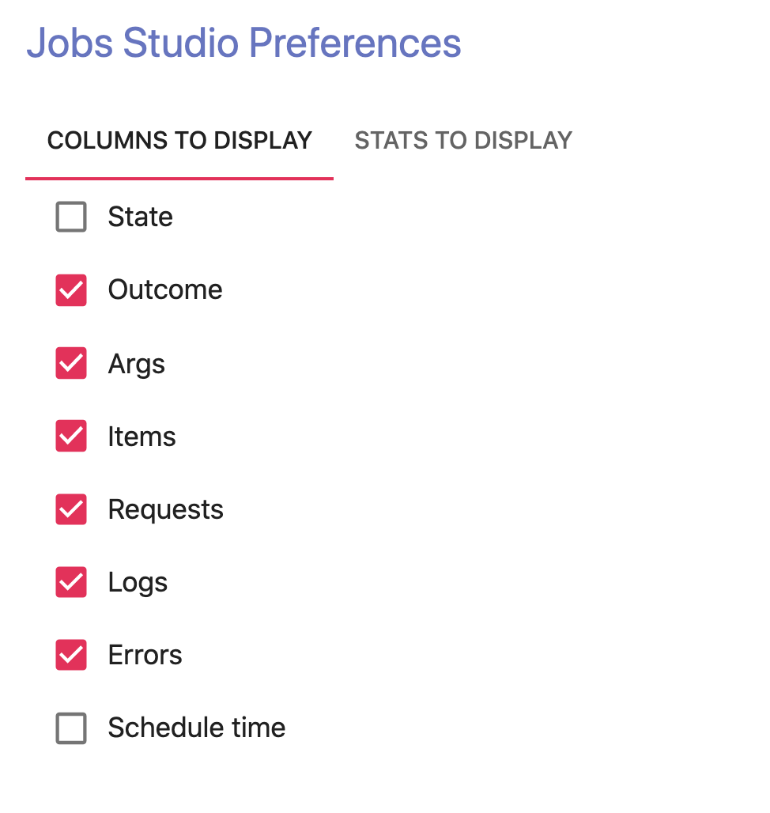
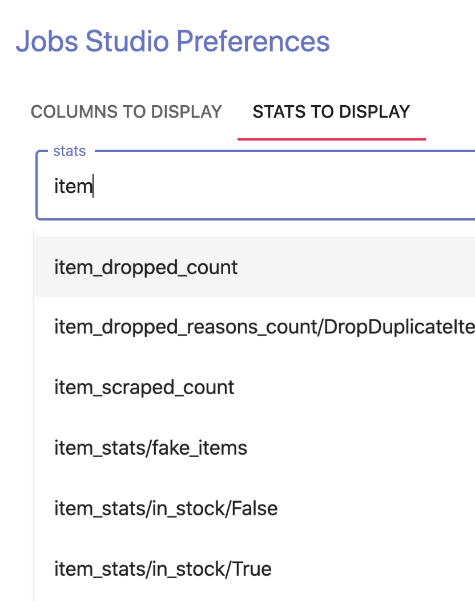
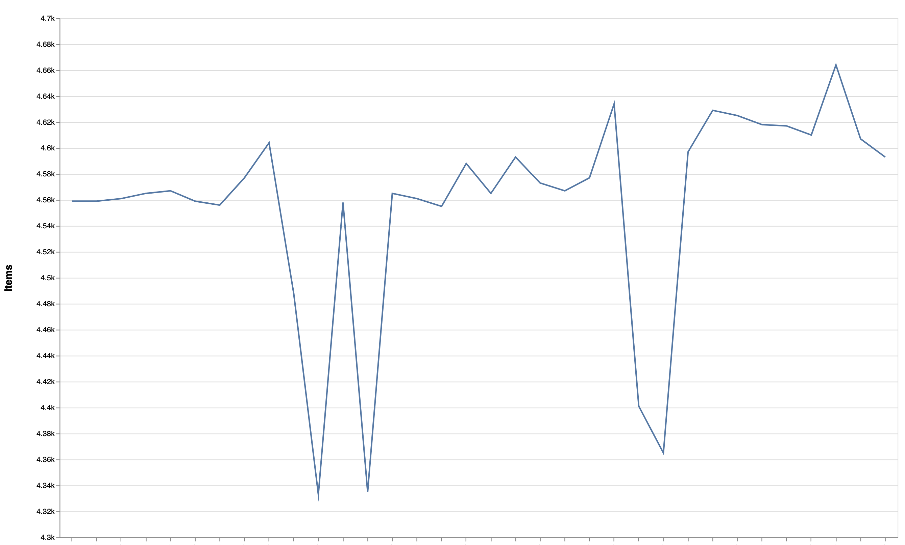

Analyze your jobs on scrapy cloud.

The tool is hosted on Github Pages: https://lucywang000.github.io/sctools/

# Screenshots

## Display multiple jobs stats as a table

## Sort jobs by some metric

## Filter jobs by spider args

## Customize which stats to show

## Select which scrapy stats to show

## Visualizing the Jobs stats

## License

Copyright © 2020 Lucy Wang

Distributed under the the Apache License, Version 2.0.
